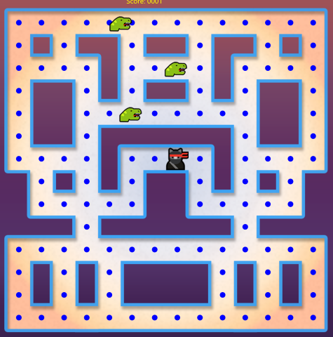

# Win2D-MazeGame

The skeleton of a classic maze chase game for Windows 10, written in C# and using Win2D.

## Introduction

If you’re looking for a project to keep the kids happy, or a way to re-create the 1980’s home computer boom, you might want to try writing your own classic video game. 

A programming library for Windows 10 called [Win2D](https://github.com/Microsoft/Win2D) is perfect for drawing and animating the kind of graphics that defined early video games. 

This project uses Win2D to create the start of a maze chase game – one that you can use as the basis for your own game.  It's written in C#, and comes complete with some basic graphics to start you off.

## Requirements

This game was written on Windows 10 (Build 2004) using Visual Studio 2019.

## Instructions

1. Install the tools - you will need [Visual Studio](https://visualstudio.microsoft.com/). The free Community edition will work perfectly.
2. Download the project from this repo. The simplest way to do this is to select Download ZIP from the green CODE button, and extract all the files.
3. Load it into Visual Studio. You can double-click on game.sln to do this.
4. Build it and try it out! Make sure the target is set to x86 (in most cases) and press F5. The controls are W, A, S and D.
5. Adapt, improve and learn!

## Details

This is a simple maze chase / eat the dots game that demonstrates using Win2D to display and move images. 

### Maze.cs

This class defines the maze object. The game screen is a 1024 by 1024 canvas object, and while a single bitmap contains the maze image, behind the scenes the maze
is a 16 by 16 array of integers with each element defining the possible directions the player or baddie can move in. When a player or baddie reaches a new tile in the maze (they move pixel by pixel, but only when line up with a tile perfectly can they change direction) they look at the maze data for that location. The data tells them which directions they can move in, and also if there is a "dot" present.

### Player.cs

The player object contains the code that draws and moves the player's game character. The most involved code defines the action to take when the player's sprite reaches a tile junction, depending on what the keys (W, A, S or D) are being held down and what directions are available.

### Baddie.cs

The baddie object chases the player around the maze. In fact, the baddie currently picks a direction at random (as long as it's not doubling back), so this is a great opportunity to add some intelligence to make the baddie pick a direction that will move them closer to the player. As with the player object, a new direction is only considered when the sprite is at the tile junction. Baddies can move at different speeds, as long as the speeds are a power of 2. There are three baddies currently defined, and more can be added by copying the code already present in the MainPage.cs class.

### MainPage.cs

This is the "code behind" file for the MainPage.xaml file which defines the Win2D canvas object (where graphics can be drawn) and also sets up keyboard input events. The purpose of the code in MainPage.cs is to load the image files, and also create the player and baddie objects, and then move them around the screen based on a timer. The test for collisions is also performed in this class.

## Suggestions for features

Game states need to be defined: for example, these could be "get ready", "game running", and "game over". 

Lives need to be implemented. Traditionally you get three lives. 

At the moment nothing happens when the baddies get too close to the player - other than the game stops moving. This is where you would "lose a life" and go to a game over screen. Likewise, nothing happens when the player has passed over all the dots. You might want the next level to have more baddies, or baddies which move faster or both.

As mentioned, the baddies are not smart and pick random directions. Adding some code that picks a direction closer to the player will make for a much more challenging game. 
